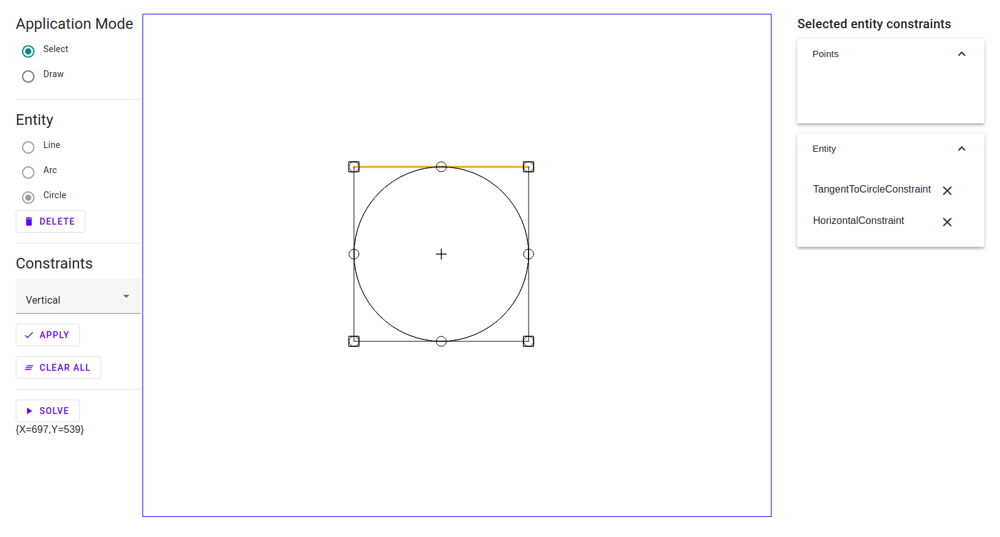

# SketchSolve



A geometric constraints solver for use in CAD software

## Background

SketchSolve can be used to solve solve geometric constraints problems found in CAD software.
This project is one of the first geometric constraints solver intended to be used in open source CAD software.
Another similar project here on Google code is [psketcher](https://code.google.com/archive/p/psketcher/). In these problems profiles can be created from
primitive objects like points, lines, circles, and arcs. These primitives are subjected to geometric
constraints like equal length, concentric arcs and so forth. The solver then solves for a set of primitive
parameters that satisfy the sketch constraints.

Currently only 2d sketch problems are supported. However I hope to soon also have a set of 3D part Assembly
constraints working. This would make SketchSolve be able to solve complex Assemblies. However, I only plan
to write that section of the code if people actually use the 2d solver.

## Implementation

The solution method used is actually a optimization method. The sum of the constraint violations are the
objective of the optimization problem. The optimization routine used is a BFGS update Newtons method.
An Optimization routine was selected because there are often more or fewer constraint equations than unknowns.

## Supported constraints

The constraints that are currently supported are the following:
* point on point
* point to line
* point on curve
* horizontal
* vertical
* radius value
* tangent to arc
* tangent to circle
* arc rules
* point to point distance
* point to point vertical distance
* point to point horizontal distance
* point to line distance
* point to line vertical distance
* point to line horizontal distance
* line length
* equal legnth
* arc radius
* equal radius arcs
* equal radius circles
* equal radius circ arc
* concentric arcs
* concentric circles
* concentric circ arc
* circle radius
* angle (between two lines)
* parallel
* perpendicular
* collinear lines
* point on circle
* point on arc
* point On midpoint of a line
* point on midpoint of an arc
* point on a quadrant point of a circle
  * +x (parameter = 0)
  * +y (parameter = 1)
  * -x (parameter = 2)
  * -y (parameter = 3)
* points symmetric about a line
* lines symmetric about a line
* circles symmetric about a line
* arcs symmetric about a line

The constraints that will be implemented soon are the following:
* others I can't think of right now
Let me know if there are constraints that you use that are not on these lists !!!!

Thanks!

## Prerequisites
* .NET Core 6

## Getting started
```bash
$ git clone https://github.com/TrevorDArcyEvans/SketchSolve.NET.git
$ cd SketchSolve.NET
$ dotnet restore
$ dotnet build
$ dotnet test
$ cd SketchSolve.UI.Web
$ dotnet run
```
open [SketchSolve.NET](https://localhost:5001/)

## Problem formulation
Each constraint has a notion of 'error' ie how 'far' away it is from it's target condition.
In this project, constraint parameters are varied to minimise the overall (sum of all individual) errors.
Thus, the problem is reduced to finding the global/local minima nearest the initial starting point.
Note that some constraints are linear and others are angular, which makes summing an overall error
problematic ie adding incompatible units.

This is achieved by using [Accord Framework](http://accord-framework.net/) and its 
[AugmentedLagrangian](http://accord-framework.net/docs/html/T_Accord_Math_Optimization_AugmentedLagrangian.htm)
solver with the solution gradient computed by a
[FiniteDifferences](http://accord-framework.net/docs/html/Overload_Accord_Math_Differentiation_FiniteDifferences_Gradient.htm)
method.

### Advantages
* easy to add new constraints
* relatively easy implementation
* techniques for multi-dimension constrained optimisation well known

### Disadvantages
* cannot detect over/under/ill constrained systems
* can only return one solution
* numerical instability aka ill conditioning (see below)

### Ill conditioning
Some of the unit tests are [ill conditioned](https://en.wikipedia.org/wiki/Condition_number) in that a
very small change to the starting position will result in finding an 'acceptable' solution rather than not.
A solution is 'found' when varying parameters results in the overall error increasing ie solution
gradient iss zero.
An 'acceptable' solution is one for which the overall error is within some user defined limit.

If an 'unacceptable' solution is found, the problem **may** be ill conditioned.  If this is
suspected, then randomly perturbing the starting position **may** result in an 'acceptable'
solution.  Conceptually, this is moving the starting position such that the solution
gradient is pointing to another/better, hopefully global, minima.  Note that there are no
guarantees that the next minima is more acceptable.

Further, in some cases, _Accord_ will try to set a parameter to [NaN](https://en.wikipedia.org/wiki/NaN)
(Not a Number), which is obviously an error.

## Further work
* ~~refactor to class based constraints~~
* ~~fix unit tests not running on Linux~~
* ~~ConstraintBuilder support for all constraints~~
* fix arc related constraints
  * line tangent to arc
  * point on arc
  * point on arc mid-point
* unit tests for constraint errors
* unit tests for constraint parameters
* ~~fix unit tests for solver~~
* more unit tests for solver
* ~~portable UI aka test harness~~
* ~~perturb starting parameters for unacceptable solutions~~
  * ~~have to limit number of perturbations~~ 

## Further information
* [Geometric constraint solving - Wikipedia](https://en.wikipedia.org/wiki/Geometric_constraint_solving)
* [Sketchpad](https://en.wikipedia.org/wiki/Sketchpad)
* [A Geometric Constraint Solver](https://core.ac.uk/download/pdf/4971979.pdf)
* [Modelling of Geometric Constraints in CAD-Applications](https://userpages.uni-koblenz.de/~ros/ModellingGeometricConstraints.pdf)
* [Interactive 2D Constraint-Based Geometric Construction System](http://papers.cumincad.org/data/works/att/41d4.content.pdf)
* [Geometric Sketch Constraint Solving with User Feedback](https://acdl.mit.edu/ESP/Publications/AIAApaper2013-0702.pdf)
* [OpenCSM: An Open-Source Constructive Solid Modeler for MDAO](https://acdl.mit.edu/esp/Publications/AIAApaper2013-0701.pdf)
* [SolveSpace - parametric 3d CAD](https://solvespace.com/index.pl)
* [Geometric Constraint Solving](geosolver.sourceforge.net)
* [imuli/geosolver-python](https://github.com/imuli/geosolver-python)

## Acknowledgements

This repository was cloned from [SketchSolve.NET](https://github.com/bradphelan/SketchSolve.NET)
which in turn was cloned from [SketchSolve](http://code.google.com/p/sketchsolve/.)

## License

The [LICENSE](LICENSE) file was inferred from the license field on the google code project,
but was not inserted by the original creator.

